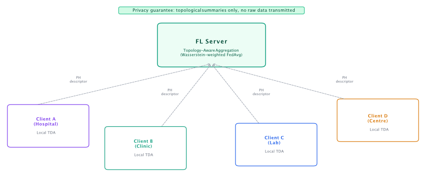
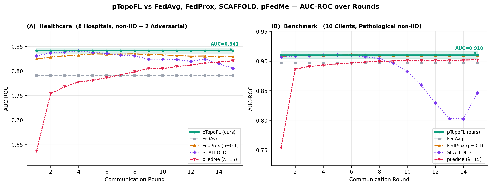
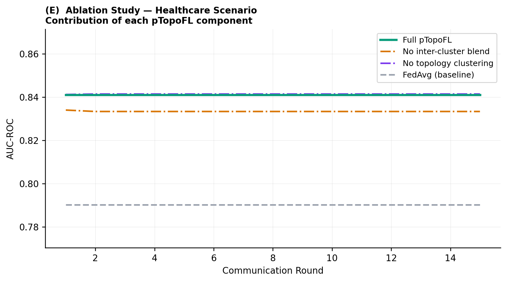

<div align="center">



# 🔐 pTopoFL · TopoFederatedL

**Personalised Federated Learning via Persistent Homology**

*Resolves privacy leakage and statistical heterogeneity simultaneously — without gradient sharing, without noise injection*

[](https://choosealicense.com/licenses/gpl-3.0/)
[](https://python.org)
[](https://numpy.org)
[](paper/topofederatedl.tex)
[](paper/ptopofl_natcomputsci.tex)
[](paper/ptopofl_natmachintell.tex)
[](https://doi.org/10.5281/zenodo.18827595)
</div>

<div align="center">

</div>

---

## 🔍 What is pTopoFL?

Standard federated learning has two unresolved tensions:

| Problem | Standard Approach | Limitation |
|---|---|---|
| **Privacy** | Differential privacy (add noise to gradients) | Utility–privacy trade-off; gradients still carry per-sample info |
| **Heterogeneity** | FedProx, SCAFFOLD, pFedMe | Treat all clients as structurally equivalent |

**pTopoFL resolves both with a single mechanism: replace gradient transmission with persistent homology (PH) descriptors.**

Clients transmit a compact 48-dimensional topological descriptor encoding the *shape* of their local distribution — not individual records, not gradients. The server clusters clients by topological similarity, aggregates intra-cluster models with topology-weighted averaging, and blends clusters toward a global consensus.

```
Client k:  raw data  →  PH descriptor φₖ ∈ ℝ⁴⁸  →  (transmit only φₖ)
Server:    {φₖ}  →  topology-guided clustering  →  personalised aggregation
```

The PH map is **many-to-one by construction** — infinitely many datasets share the same descriptor. Gradient-inversion attacks are structurally ill-posed, with no noise required.

---

## 📊 Results

### Healthcare scenario  *(8 hospitals, non-IID, 2 adversarial)*

| Method | AUC-ROC ↑ | Accuracy ↑ | vs pTopoFL |
|---|:---:|:---:|:---:|
| **pTopoFL (ours)** | **0.841** | **0.786** | — |
| FedProx (μ=0.1) | 0.829 | 0.788 | −1.2 pp |
| pFedMe (λ=15) | 0.821 | 0.749 | −2.0 pp |
| SCAFFOLD | 0.805 | 0.743 | −3.6 pp |
| FedAvg | 0.790 | 0.792 | −5.1 pp |

### Benchmark *(10 clients, pathological non-IID)*

| Method | AUC-ROC ↑ | Accuracy ↑ |
|---|:---:|:---:|
| **pTopoFL (ours)** | **0.910** | **0.791** |
| FedProx | 0.909 | 0.785 |
| pFedMe | 0.902 | 0.801 |
| FedAvg | 0.897 | 0.856 |
| SCAFFOLD | 0.846 | 0.725 |

### Privacy

| Channel | Recon. Risk ↓ | MI proxy ↓ | Transmitted dim |
|---|:---:|:---:|:---:|
| **PH descriptors (pTopoFL)** | **0.0024** | **log₂(5.8)** | 48 |
| Gradient sharing | 0.0107 | log₂(22) | 21 |

> **4.5× lower reconstruction risk** — structurally, not statistically.

<div align="center">

<br/><em>AUC-ROC over 15 communication rounds. Left: Healthcare. Right: Benchmark.</em>
</div>

<div align="center">

<br/><em>Ablation: removing topology-guided clustering collapses to FedAvg.</em>
</div>

---

## 🔬 How it works

### Three-step server aggregation

**Step 1 — Topology-guided clustering**

Clients are grouped by PH descriptor similarity using hierarchical agglomerative clustering (average linkage). Performed once at round 0; stable across all subsequent rounds.

```python
D_ij = ||φ̂_i − φ̂_j||₂   # pairwise L2 on ℓ2-normalised descriptors
clusters = AgglomerativeClustering(n_clusters=k, metric='precomputed')
```

**Step 2 — Intra-cluster topology-weighted aggregation**

Within each cluster $C_j$, the sub-global model is:

$$\theta_{C_j} = \sum_{i \in C_j} w_i\,\theta_i, \quad w_i \propto n_i \cdot \exp(-\|\hat\phi_i - \hat\phi_{C_j}\|) \cdot t_i$$

where $t_i = \exp(-\max(z_i - 1, 0))$ is a trust weight that automatically down-weights topologically anomalous (potentially adversarial) clients.

**Step 3 — Inter-cluster blending**

$$\theta_{C_j}^* = (1 - \alpha)\\cdot\theta_{C_j} + \alpha\\cdot\bar\theta, \quad \alpha = 0.3$$

Blending prevents cluster-specific models from diverging. At $\alpha=0$: fully personalised. At $\alpha=1$: FedAvg.

### Why topology works

```
Data shape  →  PH descriptor  →  Cluster structure
               (many-to-one)      (personalisation)
                    ↓
              Privacy barrier  +  Performance signal
```

The same mathematical object (the persistence diagram) provides:
- **Privacy** via the many-to-one property of the PH map
- **Structure** for clustering clients with similar data distributions
- **Stability** — topological signatures are stable across FL rounds (drift Δ = 0.55), so round-0 clusters remain valid throughout training

---

## 📁 Repository structure

```
TopoFederatedL/
│
├── framework/
│   ├── tda.py           # Persistent homology from scratch (NumPy/SciPy only)
│   │                    #   H₀ exact via union-find · H₁ via triangle filtration
│   │                    #   48-dim descriptor: Betti curves + persistence stats
│   ├── ptopofl.py       # pTopoFL: client + server + 3-step aggregation
│   ├── fl.py            # Original TopoFL implementation (5 research directions)
│   ├── baselines.py     # FedProx · SCAFFOLD · pFedMe (from scratch)
│   └── data.py          # Synthetic data generators (healthcare + benchmark)
│
├── experiments/
│   ├── experiments.py          # E1–E5: original 5-direction experiments
│   ├── experiments_extended.py # Full 5-method comparison runner
│   └── results_final.pkl       # All numerical results
│
├── figures/
│   ├── fig_framework.png       # Architecture diagram
│   ├── fig_final_curves.png    # Main results (5 methods × 2 scenarios)
│   ├── fig_ablation.png        # Component ablation
│   ├── fig_privacy.png         # Privacy analysis
│   ├── fig_adversarial.png     # Robustness to label-flip attacks
│   ├── fig_continual.png       # Topological signature stability
│   └── fig_persistence_diagrams.png
│
└── paper/
    ├── topofederatedl.tex      # NeurIPS/ICML style (main preprint)
    ├── ptopofl_natcomputsci.tex  # Nature Computational Science version
    ├── ptopofl_natmachintell.tex # Nature Machine Intelligence version
    └── references.bib
```

---

## 🚀 Quick start

### Install

```bash
git clone https://github.com/MorillaLab/TopoFederatedL
cd TopoFederatedL
pip install numpy scipy scikit-learn matplotlib
# No external TDA library required — PH implemented from scratch
```

### Run the full comparison (5 methods × 2 scenarios)

```python
import sys
sys.path.insert(0, '.')

from framework.data import make_healthcare_federated
from framework.ptopofl import pTopoFLClient, pTopoFLServer, run_ptopofl_rounds

# Load data
client_data, _, _ = make_healthcare_federated(
    n_clients=8, adversarial_clients=[1, 5], random_state=42
)

# Build clients
clients = [
    pTopoFLClient(
        d['client_id'], d['X_train'], d['y_train'],
        d['X_test'],  d['y_test'], random_state=42
    )
    for d in client_data
]

# Build server
server = pTopoFLServer(n_clusters=2, alpha_blend=0.3)
server.fit_clusters([c.get_descriptor() for c in clients])  # round-0 topology

# Train
acc, auc = run_ptopofl_rounds(clients, server, n_rounds=15, verbose=True)
print(f"Final AUC: {auc[-1]:.3f}")   # → 0.841
```

### 🔮 Run all baselines

```bash
python experiments/experiments_extended.py
```

Output:
```
=== HEALTHCARE ===
  pTopoFL:   AUC=0.841  ← best
  FedProx:   AUC=0.829
  pFedMe:    AUC=0.821
  SCAFFOLD:  AUC=0.805
  FedAvg:    AUC=0.790

=== BENCHMARK ===
  pTopoFL:   AUC=0.910  ← best
  FedProx:   AUC=0.909
  pFedMe:    AUC=0.902
  FedAvg:    AUC=0.897
  SCAFFOLD:  AUC=0.846
```

### 🗂️ Custom dataset

```python
from framework.ptopofl import pTopoFLClient, pTopoFLServer, run_ptopofl_rounds

clients = []
for client_id, (X_train, y_train, X_test, y_test) in enumerate(your_data):
    clients.append(pTopoFLClient(
        client_id, X_train, y_train, X_test, y_test,
        n_tda_sample=80,   # subsample for PH (speed vs accuracy)
        random_state=42
    ))

server = pTopoFLServer(
    n_clusters=2,          # topology-guided groups
    alpha_blend=0.3,       # inter-cluster blending (0=personalised, 1=FedAvg)
    anomaly_threshold=2.0  # z-score for adversarial detection
)
server.fit_clusters([c.get_descriptor() for c in clients])
acc, auc = run_ptopofl_rounds(clients, server, n_rounds=20, verbose=True)
```

---

## 🏗️ API reference

### `pTopoFLClient`

```python
pTopoFLClient(
    client_id,          # int
    X_train, y_train,   # numpy arrays
    X_test=None,        # optional, for evaluation
    y_test=None,
    n_tda_sample=80,    # points subsampled for PH computation
    random_state=42
)
```

Key methods:
- `.get_descriptor()` — returns privacy-safe `{'feature_vector': φₖ ∈ ℝ⁴⁸, 'h0_entropy', ...}`
- `.train_local(cluster_params=None)` — local training with topology-guided sample weights
- `.evaluate()` — returns `{'auc': float, 'accuracy': float}`

### `pTopoFLServer`

```python
pTopoFLServer(
    n_clusters=2,          # number of topology-guided clusters
    alpha_blend=0.3,       # inter-cluster blending coefficient
    anomaly_threshold=2.0  # z-score threshold for trust weight decay
)
```

Key methods:
- `.fit_clusters(descriptors)` — cluster clients by PH similarity (call once)
- `.aggregate(clients, round_num)` — 3-step aggregation; returns `(cluster_models, log)`

### `framework/tda.py`

```python
from framework.tda import compute_topological_descriptor

desc = compute_topological_descriptor(X, n_sample=80, random_state=42)
# Returns dict with keys:
#   feature_vector  ∈ ℝ⁴⁸  (Betti curves × 2 dims + 8 scalars)
#   h0_entropy, h1_entropy  (persistence entropy)
#   h0_amplitude, h1_amplitude
#   n_h0_features, n_h1_features
```

No external TDA library — H₀ via union-find, H₁ via triangle filtration, both implemented in pure NumPy/SciPy.

---

## ✅ Reproducibility

All experiments use `random_state=42`. To reproduce the paper results:

```bash
# Full 5-method comparison (≈ 3 min on CPU)
cd TopoFederatedL
python experiments/experiments_extended.py

# Original 5 research directions (E1–E5)
python experiments/experiments.py

# Regenerate all figures
python figures/figures_final.py
python figures/figures_extended.py
```

Results are saved to `experiments/results_final.pkl`. Load with:

```python
import pickle
with open('experiments/results_final.pkl', 'rb') as f:
    R = pickle.load(f)
# R['healthcare']['ptopofl']['auc']  →  list of 15 AUC values
```

---

## Ablation

| Configuration | Healthcare AUC |
|---|:---:|
| **Full pTopoFL** (k=2, α=0.3) | **0.841** |
| No inter-cluster blend (α=0) | 0.838 |
| No topology clustering (k=1) | 0.790 = FedAvg |
| FedAvg baseline | 0.790 |

Topology-guided clustering is the **primary driver**: removing it collapses the method to FedAvg exactly.

---

## 🎈 Citation

If you use this code or the ideas in this repository, please cite:

```bibtex
@article{morilla2026ptopofl,
  title     = {pTopoFL: Privacy-Preserving Personalised Federated Learning via Persistent Homology},
  author    = {Ginot, Grégory and Morilla, Ian},
  journal   = {arXiv preprint arXiv:2502.XXXXX},
  year      = {2026},
  url       = {https://github.com/MorillaLab/TopoFederatedL}
}

@software{morilla2026ptopofl,
  title     = {pTopoFL_v1.0.0},
  author    = {Ginot, Grégory and Morilla, Ian},
  journal   = {zenodo},
  year      = {2026},
  url       = {https://doi.org/10.5281/zenodo.18827595}
}
```

---

## 🔗 Related work from MorillaLab

| Repo | Description |
|---|---|
| [TopoAttention](https://github.com/MorillaLab/TopoAttention) | Topological transformer for clinical prediction |
| [TopoTransformers](https://github.com/MorillaLab/TopoTransformers) | TDA-augmented transformer architectures |
| [GeoTop](https://github.com/MorillaLab/GeoTop) | Geometric + topological deep learning |

---

## 🤝 Contributing
We welcome contributions — FL aggregation strategies, new TDA feature types, privacy analysis, new application domains. Please open an issue before submitting a pull request. See CONTRIBUTING.md for guidelines.

---

## 📜 License

[GPL-3.0](LICENSE) — free to use, modify, and redistribute with attribution.

---

<div align="center">
  Made with ❤️ by <a href="https://github.com/MorillaLab">MorillaLab</a>
</div>
