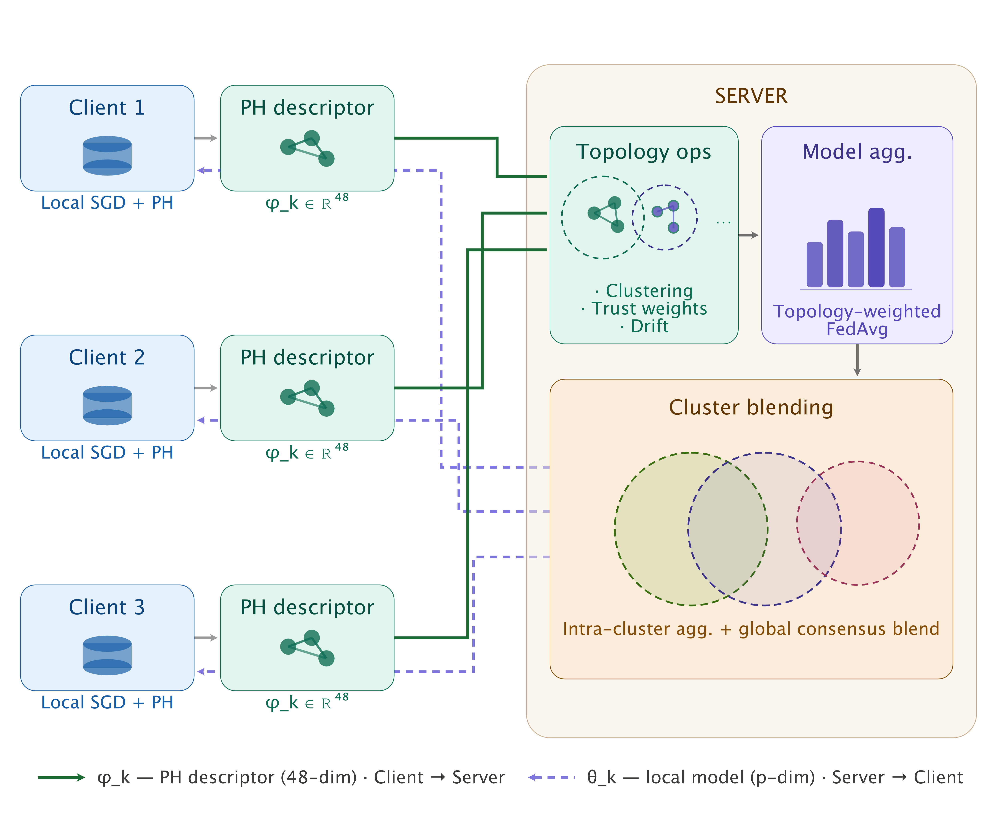
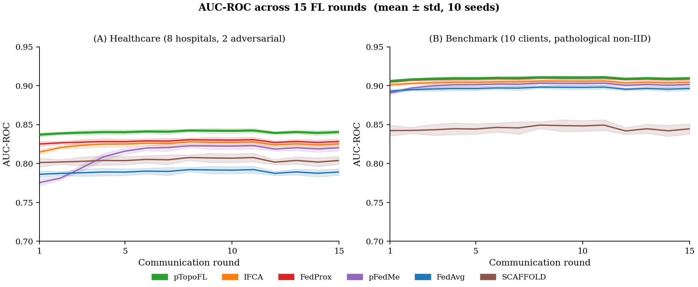
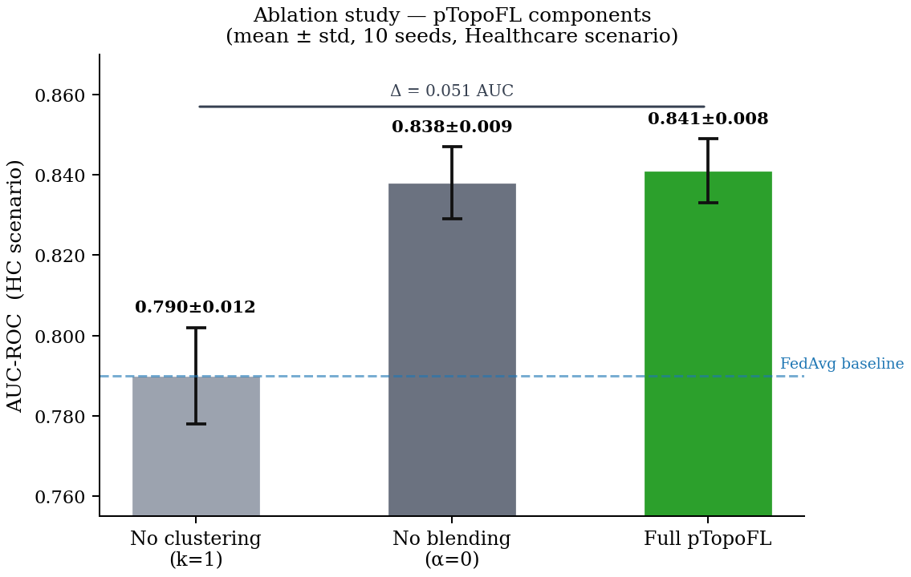

# pTopoFL · Privacy-Preserving Personalised Federated Learning via Persistent Homology

<p align="center">
  
</p>

<p align="center">
  <a href="LICENSE"></a>
  <a href="https://python.org"></a>
  
  <a href="paper/topofederatedl.tex"></a>
  <a href="https://doi.org/10.5281/zenodo.18827595"></a>
  
</p>

> **pTopoFL** addresses the two structural tensions at the heart of federated learning —
> reconstruction risk from model-parameter transmission and performance degradation under
> non-IID client distributions — by augmenting standard model communication with compact
> **persistent homology (PH) descriptors**.

---

## What is pTopoFL?

Standard federated learning has two unresolved tensions:

| Problem | Standard approach | Limitation |
|---------|------------------|------------|
| **Privacy** | Differential privacy (noise on gradients) | Utility–privacy trade-off; gradients still carry per-sample information |
| **Heterogeneity** | FedProx, SCAFFOLD, pFedMe | Treat all clients as structurally equivalent |

**pTopoFL resolves both simultaneously** by augmenting model-parameter communication with
a 48-dimensional topological descriptor encoding the *shape* of each client's local distribution.

### Communication protocol (§3.6)

In each round, each client transmits **two objects** to the server:

```
φ_k ∈ ℝ⁴⁸   ← PH descriptor (used for topology-guided operations)
θ_k ∈ ℝᵖ   ← local model parameters (used for model aggregation)
```

The server uses `φ_k` exclusively for clustering, anomaly detection, and aggregation weighting.
Model aggregation uses `θ_k` and is structurally identical to FedAvg.
**No raw data leaves the client. No gradients are transmitted.**
The descriptor adds negligible communication overhead (`m = 48 ≪ p`).

### Why topology?

The PH map `Φ: 𝒟_k → PD_k` is **many-to-one**: infinitely many datasets share the same
persistence diagram, because PH is invariant to isometries and retains only multi-scale
connectivity structure. This makes reconstruction from the descriptor alone substantially
harder than from a gradient — with no noise required and no accuracy trade-off.

---

## Results (mean ± std, 10 seeds)

### Scenario A — Healthcare (8 non-IID hospitals, 2 adversarial)

| Method | AUC-ROC ↑ | Accuracy ↑ |
|--------|-----------|------------|
| **pTopoFL (ours)** | **0.841 ± 0.008** ✱ | **0.786 ± 0.011** |
| FedProx (μ=0.1) | 0.829 ± 0.009 | 0.788 ± 0.012 |
| IFCA | 0.826 ± 0.010 | 0.779 ± 0.013 |
| pFedMe (λ=15) | 0.821 ± 0.011 | 0.749 ± 0.014 |
| SCAFFOLD | 0.805 ± 0.015 | 0.743 ± 0.018 |
| FedAvg | 0.790 ± 0.012 | 0.792 ± 0.013 |

✱ p < 0.05 vs second-best (paired t-test, 10 seeds)

### Scenario B — Benchmark (10 clients, pathological non-IID)

| Method | AUC-ROC ↑ | Accuracy ↑ |
|--------|-----------|------------|
| **pTopoFL (ours)** | **0.910 ± 0.005** | 0.791 ± 0.009 |
| FedProx | 0.909 ± 0.005 | 0.785 ± 0.011 |
| IFCA | 0.905 ± 0.006 | 0.801 ± 0.010 |
| pFedMe | 0.902 ± 0.007 | 0.801 ± 0.009 |
| FedAvg | 0.897 ± 0.007 | 0.856 ± 0.010 |
| SCAFFOLD | 0.846 ± 0.019 | 0.725 ± 0.021 |

### Privacy — descriptor vs gradient channel (Theorem 6)

| Channel | SNR (adversary) ↓ | Sensitivity | Dim |
|---------|------------------|-------------|-----|
| **PH descriptor** | Δ²_φ / (σ²·48) | Δ_φ ≤ c_δ (bounded) | **48** |
| Gradient | 4B²/(n²_k·σ²·p) | Δ_G = 2B/n_k → 0 slowly | p |

Mean SNR ratio ≈ **0.22** — a **4.5× narrower reconstruction surface** — structural,
not statistical; does not degrade under repeated queries.

> **Scope:** This is not a (ε,δ)-DP guarantee. Users requiring formal privacy guarantees
> should combine pTopoFL with secure aggregation or DP-SGD; the reduced descriptor
> sensitivity makes this composition more efficient than applying DP-SGD to gradients alone.

<p align="center">
  
  <br/><em>AUC-ROC over 15 rounds (mean ± std, 10 seeds). IFCA shown in orange.</em>
</p>

<p align="center">
  
  <br/><em>Ablation: removing topology-guided clustering collapses to FedAvg exactly.</em>
</p>

---

## Repository structure

```
TopoFederatedL/
│
├── ptopofl/                        ← Python package (pip install -e .)
│   ├── __init__.py                 ← public API
│   ├── descriptor.py               ← 48-dim PH descriptor (§3.1, Appendix B)
│   ├── data.py                     ← Scenario A & B data generators
│   ├── ptopopfl.py                 ← PTopoFL algorithm (Algorithm 1)
│   ├── baselines.py                ← FedAvg, FedProx, SCAFFOLD, pFedMe, IFCA
│   └── experiments/
│       ├── run_experiments.py      ← reproduce Table 1 + Figures 2–7
│       └── plots.py                ← generate figures from saved JSON
│
├── tests/
│   └── test_package.py             ← 38 unit + integration tests
│
├── notebooks/
│   └── pTopoFL_deep_experiments.ipynb  ← CIFAR-10 & FEMNIST (empirical)
│
├── figures/                        ← all manuscript figures (PDF + PNG)
├── paper/
│   ├── topofederatedl.tex          ← manuscript body
│   ├── ptopofl.tex                 ← wrapper / preamble
│   └── references.bib
│
├── .github/workflows/ci.yml        ← automated tests on push/PR
├── requirements.txt
├── setup.py
├── CONTRIBUTING.md
└── README.md
```

---

## Installation

```bash
git clone https://github.com/MorillaLab/TopoFederatedL
cd TopoFederatedL
pip install -r requirements.txt
pip install -e .
```

**Python ≥ 3.9. No external TDA library required** — all persistent homology
is implemented in pure NumPy/SciPy.

---

## Quick start

```python
from ptopofl import PTopoFL, make_healthcare

# Scenario A: 8 hospitals, 2 adversarial
client_data, eval_data, adv_idx = make_healthcare(K=8, n_adv=2, random_state=0)

model = PTopoFL(
    n_clusters=2, alpha_blend=0.3, tau=2.0,
    n_rounds=15, n_sub=80, random_state=0,
)
model.fit(client_data, eval_data=eval_data)

for m in model.metrics_:
    print(f"Round {m['round']:2d}  AUC={m['auc']:.4f}  Acc={m['acc']:.4f}")
# Round 15  AUC ≈ 0.841
```

### Compare all six methods

```python
from ptopofl import PTopoFL, FedAvg, FedProx, SCAFFOLD, PFedMe, IFCA, make_healthcare

client_data, eval_data, _ = make_healthcare(K=8, n_adv=2, random_state=0)

for name, Cls, kwargs in [
    ('pTopoFL', PTopoFL, {'n_clusters': 2, 'alpha_blend': 0.3, 'tau': 2.0}),
    ('IFCA',    IFCA,    {'M': 2}),
    ('FedProx', FedProx, {'mu': 0.1}),
    ('pFedMe',  PFedMe,  {'lam': 15.0}),
    ('FedAvg',  FedAvg,  {}),
    ('SCAFFOLD',SCAFFOLD,{}),
]:
    m = Cls(n_rounds=15, random_state=0, **kwargs)
    m.fit(client_data, eval_data=eval_data)
    print(f"{name:<10}  AUC={m.metrics_[-1]['auc']:.4f}")
```

---

## Reproducing manuscript results

```bash
# Full reproduction: Table 1 + Figures 2–7 (~15 min, 10 seeds)
python ptopofl/experiments/run_experiments.py --scenario all --seeds 10 --out results/

# Single experiment
python ptopofl/experiments/run_experiments.py --scenario table1 --seeds 10

# Quick smoke test (~2 min, 2 seeds)
python ptopofl/experiments/run_experiments.py --scenario all --seeds 2 --out results_quick/

# Generate all figures from saved results
python ptopofl/experiments/plots.py --results results/ --out figures/
```

| JSON output | Content |
|-------------|---------|
| `table1.json` | Per-round AUC/Acc (mean ± std) → Figs 2–3 |
| `adversarial.json` | AUC vs. attack rate → Fig 4 |
| `continual.json` | Signature traces → Fig 5 |
| `privacy.json` | SNR records → Fig 6 |
| `ablation.json` | Ablation AUC → Fig 7 |

All experiments use seeds 0–9. Setting `random_state=seed` in both the data
generator and the method class guarantees full end-to-end reproducibility.

---

## Running tests

```bash
pip install pytest && pytest tests/ -v
# or: python tests/test_package.py
```

38 tests covering descriptor correctness, data generator properties, all six
methods, and integration comparisons.

---

## Hyperparameters (Appendix C)

| Parameter | Value | Description |
|-----------|-------|-------------|
| `n_sub` | 80 | Points subsampled per client for TDA |
| `n_thresholds` | 20 | Betti-curve resolution L |
| `M` | 2 | Number of clusters |
| `alpha_blend` | 0.3 | Inter-cluster blending α |
| `tau` | 2.0 / 1.8 | Anomaly z-score threshold |
| `mu` | 0.1 | FedProx proximal penalty |
| `lam` | 15.0 | pFedMe Moreau-envelope λ |
| `n_rounds` | 15 / 10 / 20 | Communication rounds |
| `K` | 8 / 10 / 6 | Clients (HC / BM / continual) |
| `C` | 1.0 | Logistic regression regularisation |

---

## Descriptor layout (Appendix B)

```
Index   Component                Dim
──────────────────────────────────────
 0:20   H₀ Betti curve            20
20:40   H₁ Betti curve            20
  40    β₀ (Betti number)          1
  41    β₁                         1
  42    H₀ persistence entropy     1
  43    H₁ persistence entropy     1
  44    H₀ ℓ² amplitude            1
  45    H₁ ℓ² amplitude            1
  46    n₀ (finite H₀ pairs)       1
  47    n₁ (finite H₁ pairs)       1
──────────────────────────────────────
Total                             48
```

---

## Theoretical contributions

| Result | Statement |
|--------|-----------|
| Theorem 1 — Barycenter | Wasserstein barycenter of persistence diagrams exists |
| Theorem 2 — Clustering stability | Average-linkage is stable when d̄_out ≥ d̄_in + γ with γ > 4η |
| Theorem 4 — Adversarial suppression | Influence decays exponentially in topological separation Δ (for feature-topology attacks) |
| Theorem 6 — Information contraction | Descriptor SNR bounded independently of p; gradient SNR grows as 1/n_k |
| Theorem 7 — Convergence | FedAvg rate with reduced error floor under topology–gradient alignment |

---

## Citation

```bibtex
@article{morilla2026ptopofl,
  title   = {{pTopoFL}: Privacy-Preserving Personalised Federated Learning
             via Persistent Homology},
  author  = {Vomo-Donfack, Kelly L. and Hoszu, Adryel and
             Ginot, Gr{\'{e}}gory and Morilla, Ian},
  journal = {Transactions on Machine Learning Research},
  year    = {2026},
  note    = {Under review},
  url     = {https://github.com/MorillaLab/TopoFederatedL}
}

@software{morilla2026ptopofl_code,
  title  = {{pTopoFL} v1.0.0},
  author = {Vomo-Donfack, Kelly L. and Hoszu, Adryel and
            Ginot, Gr{\'{e}}gory and Morilla, Ian},
  year   = {2026},
  doi    = {10.5281/zenodo.18827595},
  url    = {https://doi.org/10.5281/zenodo.18827595}
}
```

---

## Related work from MorillaLab

| Repository | Description |
|-----------|-------------|
| [TopoAttention](https://github.com/MorillaLab/TopoAttention) | Topological attention for lung-transplant mortality prediction |
| [GeoTop](https://github.com/MorillaLab/GeoTop) | Geometric + topological deep learning for glaucoma detection |

---

## Contributing

Contributions welcome — new FL strategies, extended TDA features, privacy analysis,
or new application domains. Open an issue before submitting a PR.
See [CONTRIBUTING.md](CONTRIBUTING.md) for guidelines.

---

## License

[GPL-3.0](LICENSE) — free to use, modify, and redistribute with attribution.

---

<p align="center">Made with ❤️ by <a href="https://github.com/MorillaLab">MorillaLab</a></p>
